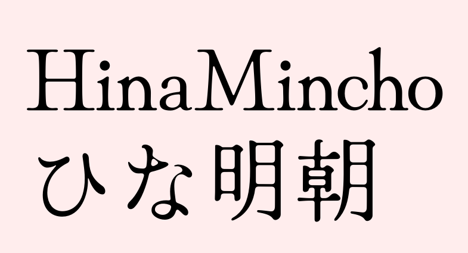
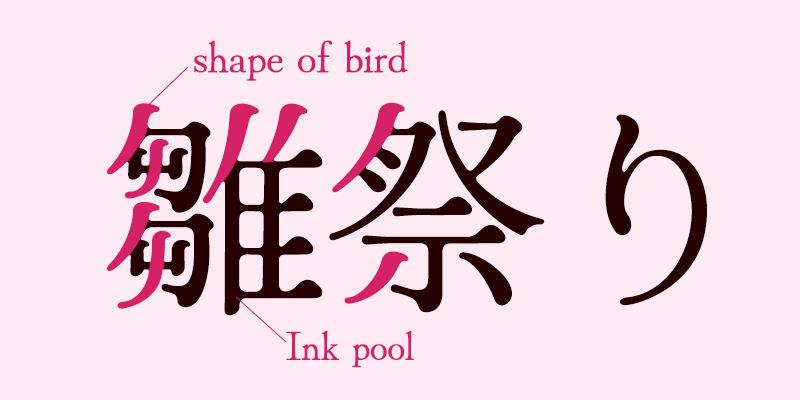

# Hina-Mincho
こちらは「Hina Mincho」開発プロジェクトです。 
日本語の解説は後半に記載しております。 

 

<h2>About ‘Hina Mincho’</h2>
Hina Mincho is a Japanese Old-fashioned Mincho-style font. 

<h2>Characteristic</h2>
 
・Image of Hina doll(Old-fashioned and cute) 
・Brushstroke design in the shape of birds with a sense of fun 
・Expression of ink pool 
・Narrow ‘Futokoro’ and lively sweeping line 

<h2>Lisence</h2>
SIL Open Font Lisence 
Please read OFT.txt for more info. 

<h2>Supported Characters</h2>
Google Latin Plus(https://github.com/googlefonts/gftools/blob/master/Lib/gftools/encodings/GF%20Glyph%20Sets/GF-latin-plus_unique-glyphs.nam) 
Hiragana 
Katakana 
Halfwidth-Katakana 
Kanji JIS Level1, 2 and ‘頰’, ‘塡’, ‘剝’, ‘𠮟’ 
Cyrillic and Greek 
Punctuations and symbols 

<h2>「HinaMincho」について</h2>
HinaMinchoは古風でかわいらしく品のある雛人形をイメージした明朝体です。 
全体的に丸みをおびた形状でやわらかい印象になるようにしました。 
本文、タイトルなど幅広く使えるデザインを目指しています。 

<h2>Hina Minchoの特徴</h2>
・雛人形のイメージの、古風でふんわりとしたかわいらしい明朝体 
・漢字の起筆から払いまでを鳥の形っぽくした遊び心のあるデザイン 
・墨溜まりの表現であたたかみや味のある形（デジタル文字っぽくなりすぎない） 
・懐は狭めで払いをのびやかにしたメリハリのある漢字

<h2>ライセンス</h2>
SIL Open Font License Version 1.1 
詳細はライセンス原文（https://licenses.opensource.jp/OFL-1.1/OFL-1.1.html） 
またはリポジトリ内のOFL.txtをご確認下さい。 

<h2>収録予定文字</h2>
・半角英数、約物、ラテン拡張文字など（Google Latin Plus）592文字以上 
・ひらがな89グリフ、全角カタカナ94グリフ 
・半角カタカナ55グリフ 
・全角英数、全角記号 
・IBM拡張文字の記号 
・「㋿（uni32FF）」、囲み数字などの記号 
・JIS第1水準2965文字 
・JIS第2水準3390文字 
・IBM拡張文字388文字 
・第三水準の常用漢字「頰」「塡」「剝」「𠮟」 
・その他（ギリシャ文字、キリル文字など） 
