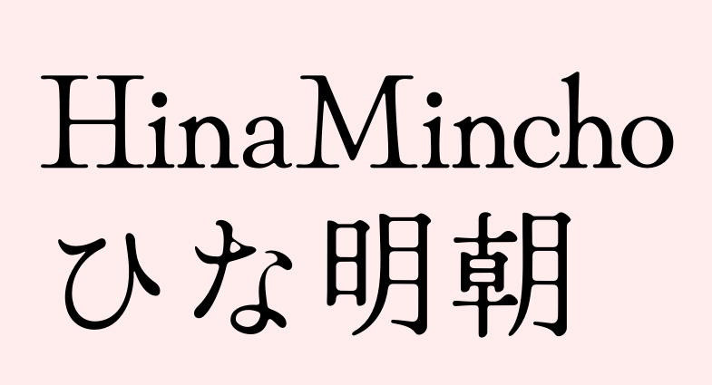
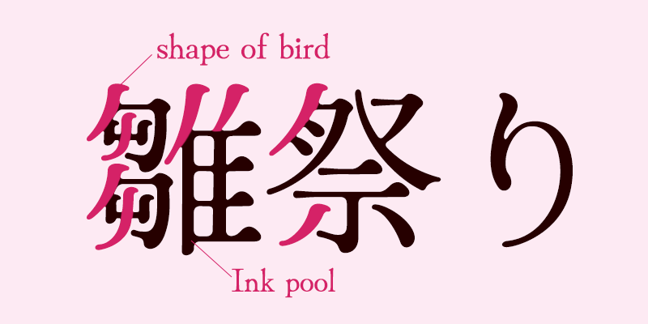

# Hina-Mincho
こちらは「Hina Mincho」開発プロジェクトです。
日本語の解説は後半に記載しております。

## About ‘Hina Mincho’
Hina Mincho is a Japanese Old-fashioned Mincho-style font.

## Characteristic

- Image of Hina doll(Old-fashioned and cute)
- Brushstroke design in the shape of birds with a sense of fun
- Expression of ink pool
- Narrow ‘Futokoro’ and lively sweeping line

## Lisence
SIL Open Font Lisence
Please read OFT.txt for more info.

## About the origin of Hina Mincho
Hina Mincho was designed and developed by satsuyako.  
The project began in January 2020 and was completed in January 2022,  
then later added to Google Fonts(https://fonts.google.com/specimen/Hina+Mincho).

If you create or distribute derivative works based on Hina Mincho,  
please include proper credit to the original author in accordance with the SIL Open Font License 1.1.

## Supported Characters
- Google Latin Plus
- Hiragana
- Katakana
- Halfwidth-Katakana
- Kanji JIS Level1, 2 and ‘頰’, ‘塡’, ‘剝’, ‘𠮟’
- Cyrillic and Greek
- Punctuations and symbols

## sources/archive/
This repository previously included a `.glyphs` source created in Glyphs 2.  
As of version 1.004, the source has been migrated to the `.glyphspackage` format for Glyphs 3.  
The old `.glyphs` file is retained in `/archive` for reference only and should not be used for editing.

## /fonts/archive/old_fonts/
This folder contains previously built TTF files based on the old `.glyphs` source (Glyphs 2).  
These are retained for reference only and should not be used in production.

---

## 「HinaMincho」について
HinaMinchoは古風でかわいらしく品のある雛人形をイメージした明朝体です。  
全体的に丸みをおびた形状でやわらかい印象になるようにしました。  
本文、タイトルなど幅広く使えるデザインを目指しています。

## Hina Minchoの特徴

- 雛人形のイメージの、古風でふんわりとしたかわいらしい明朝体
- 漢字の起筆から払いまでを鳥の形っぽくした遊び心のあるデザイン
- 墨溜まりの表現であたたかみや味のある形（デジタル文字っぽくなりすぎない）
- 懐は狭めで払いをのびやかにしたメリハリのある漢字

## ライセンス
SIL Open Font License Version 1.1  
詳細はライセンス原文（https://licenses.opensource.jp/OFL-1.1/OFL-1.1.html）  
またはリポジトリ内のOFL.txtをご確認下さい。

## ひな明朝の起源について
ひな明朝は satsuyako によって設計・開発されました。  
2020年1月に制作を開始し、2022年1月に完成しました。  
その後 Google Fonts(https://fonts.google.com/specimen/Hina+Mincho) にも収録されています。

本フォントをもとにした派生作品を制作・配布される場合は、  
SIL Open Font License 1.1 に基づき、  
原著作者のクレジットを明記していただけますようお願いいたします。

## 対応文字
- Google Latin Plusに準拠したラテン文字セット
- ひらがな
- カタカナ（全角・半角）
- 漢字（JIS第1水準・第2水準 + 『頰』『塡』『剝』『𠮟』）
- キリル文字・ギリシャ文字
- 記号・約物類

## sources/archive/ フォルダについて
このリポジトリには以前、Glyphs 2 で作成された.glyphs形式のソースファイルが含まれていました。  
バージョン 1.004 以降は、Glyphs 3 に対応した.glyphspackage形式へと移行されています。

archive フォルダ内の .glyphs ファイルは参照用に残しているものであり、編集には使用しないでください。

## /fonts/archive/old_fonts/ フォルダについて
このフォルダには、旧.glyphsソース（Glyphs 2）をもとに書き出された過去のTTFファイルが保管されています。  
これらも参照用に残しているものであり、商用・配布用途での使用は推奨されません。

